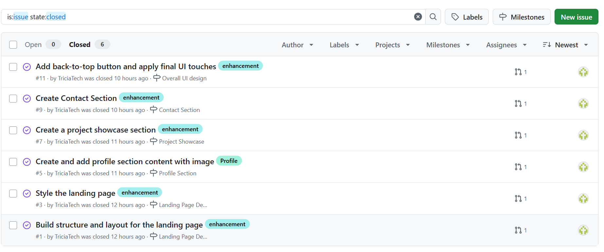
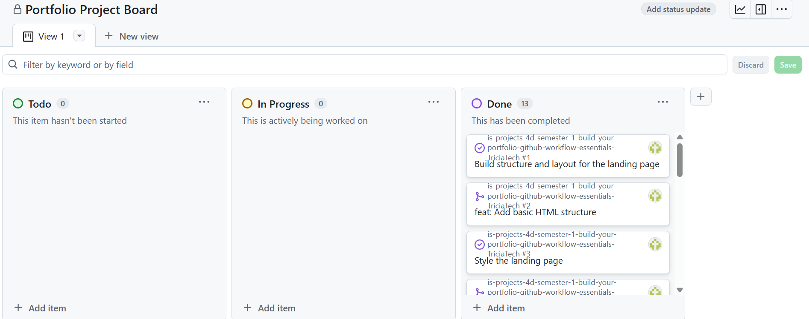
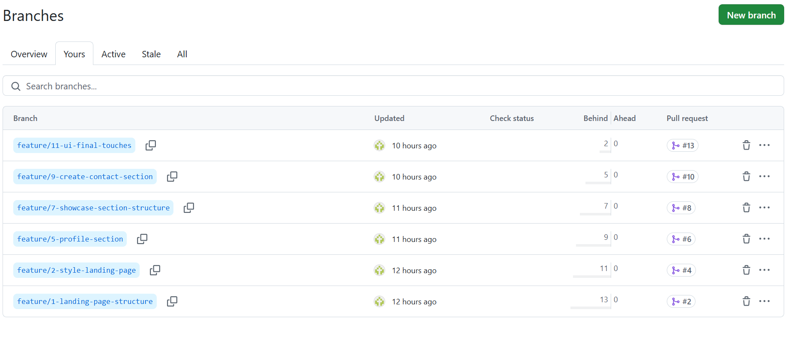
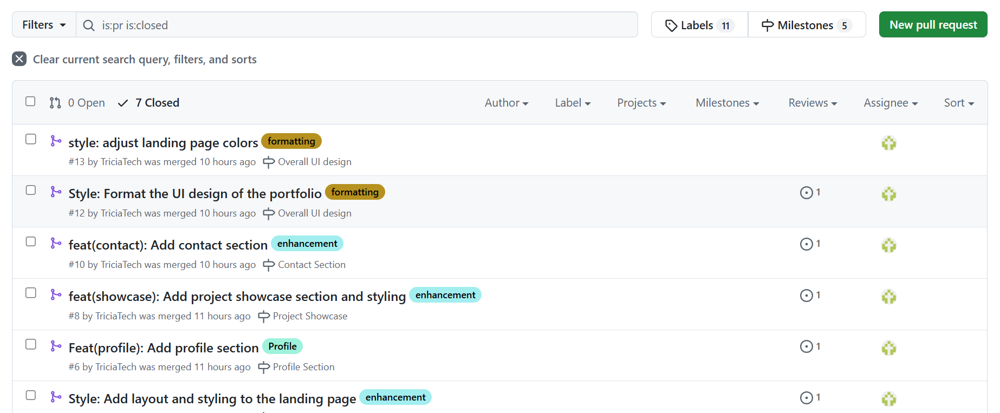

# Personal Portfolio Documentation

## 1. Student Details

- **Full Name**:Mwaura Patricia Wangu
- **Admission Number**:143886
- **GitHub Username**:TriciaTech
- **Email**:patricia.mwaura@strathmore.edu

## 2. Deployed Portfolio Link

- **GitHub Pages URL**:  
  (https://triciatech.github.io/is-projects-4d-semester-1-build-your-portfolio-github-workflow-essentials-TriciaTech/)

## 3. Learnings from the Git Crash Program

Write about **4 things** you expected to learn during the Git crash course (yes, we all came in with some big hopes 😅).
For each one, mention:

What you thought it would be like **(Expectation 👀)**

What you actually learned **(Reality 😅)**

And how it helped with your personal portfolio project 💻

make it honest—and if it surprised you, even better!

1. Concept: Pull Requests

Expectation: I assumed pull requests were mainly used in large teams, just a formality to approve code changes.

Reality: I discovered they are an essential tool for collaboration. They serve as a checkpoint to review code, discuss changes and resolve conflicts. I even encountered a merge conflict and had to resolve it before merging, something I didn’t expect to deal with.

Impact: This made me more thoughtful about the changes I pushed and improved how I collaborated with my team during the portfolio project.

2. Concept: Commit Messages

Expectation: I believed commit messages could be anything as long as I remembered what I did, there was no need for structure.

Reality: I learned that structured commit messages, using types like feat, style, and docs, not only made the project look more professional but also made it easier to track changes and understand the development history.

Impact: My commit history was organized, and it made debugging or reviewing changes far more manageable, especially when working with others.

3. Concept: GitHub Project Boards

Expectation: I thought the project board was just a decorative feature, more of an optional extra than something we’d actually rely on.

Reality: It became a central part of how I managed my tasks. Moving items from "To Do" to "In Progress" and then to "Done" gave me a real sense of structure and progress.

Impact: It helped me stay on track and manage my work across different parts of the portfolio, from the landing page to the final touches.

4. Concept: Cloning vs Forking

Expectation: I thought cloning and forking were basically the same thing, that they both created a copy of the code. 

Reality: I realized forking is used to create your own version of a repository (especially when it’s someone else’s), while cloning is what you do to bring that repository into your local environment to work on it.

Impact: I forked the assignment repository, cloned it locally and worked from my own version. This gave me the confidence to experiment and contribute without worrying about affecting the original source.

## 4. Screenshots of Key GitHub Features

Include screenshots that demonstrate how you used GitHub to manage your project. For each screenshot, write a short caption explaining what it shows.

> Upload the screenshots to your GitHub repository and reference them here using Markdown image syntax:
> (you could just simply copy and paste the image into the Assignment.md)

```markdown

```

### A. Milestones and Issues

- Screenshot showing your milestone(s) and the issues linked to it.



### B. Project Board

- Screenshot of your GitHub Project Board with issues organized into columns (e.g., To Do, In Progress, Done).


### C. Branching

- Screenshot showing your branch list with meaningful naming.


### D. Pull Requests

- Screenshot of a pull request that’s either open or merged and linked to a related issue.



